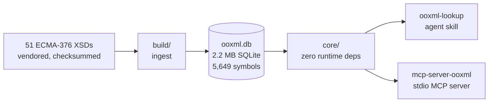

<div align="center">

<picture>
  <source media="(prefers-color-scheme: dark)" srcset="assets/banner-dark.svg">
  
</picture>

Ask the ECMA-376 schema what is legal in a `.docx`, `.xlsx` or `.pptx`, offline.

[](https://github.com/shbernal/ooxml-ai-tooling/actions/workflows/ci.yml)
[](LICENSE)

---

[Why this project?](#why-this-project) • [Install](#install) • [Usage](#usage) • [How it works](#how-it-works) • [Related projects](#related-projects)

---

</div>

<p align="center">
<picture>
  <source media="(prefers-color-scheme: dark)" srcset="assets/demo-dark.svg">
  
</picture>
</p>

## Why this project?

You ask your agent to change code that writes `.docx`, `.xlsx` or `.pptx` files.
It writes the XML, the tests pass, and then Word says the file has unreadable content.
Or Excel offers to repair it and drops half the sheet.

The agent guessed.
Office files follow ECMA-376, a standard thousands of pages long, and the details that break a file are easy to get wrong from memory.
Elements must appear in a fixed order.
An attribute that works on one element doesn't exist on its neighbour.
A value that looks reasonable isn't in the allowed list.

This project lets the agent look it up instead. Before it writes an element, it can ask:

- What can go inside this element, and in what order?
- Which attributes does it take, and what values do they accept?
- Why did the validator reject this file, and what would have been legal?

Answers come from the standard itself and cover Word, Excel and PowerPoint files.
Everything runs on your machine, with no account and no network calls.
Install it as an MCP server, or as an agent skill for agents with a shell like Claude Code and Codex.

[`docs/what-it-answers.md`](docs/what-it-answers.md) lists exactly what it can answer, and where a naive reading of the schemas goes wrong.

## Install

### MCP server

[](.nvmrc)
[](https://www.npmjs.com/package/mcp-server-ooxml)

Add it to your MCP client's config. The database ships inside the npm package, so there is nothing to download on first run.

```json
{
  "mcpServers": {
    "ooxml": {
      "command": "npx",
      "args": ["-y", "mcp-server-ooxml"]
    }
  }
}
```

### Agent skill

[](.nvmrc)
[![ClawHub](https://img.shields.io/badge/dynamic/json?url=https%3A%2F%2Fclawhub.ai%2Fapi%2Fv1%2Fskills%2Fooxml-lookup&query=%24.latestVersion.version&prefix=v&label=ooxml-lookup&labelColor=555555&style=for-the-badge&color=F5654A&logo=data%3Aimage%2Fpng%3Bbase64%2CiVBORw0KGgoAAAANSUhEUgAAABwAAAAcCAYAAAByDd%2BUAAAG%2BklEQVRIx22WW4idVxXHf2vt%2FZ37mcuZdHKZpM29iQZEWoRiqb1QKFotKlRbaPVV%2B%2BaLRbC%2B9kH0QfC94AWhoFQUhaIUq0FL2wltY5qmmUkmmcxMZpK55HzfOd%2F37b18ODNnZmw3LDh8rLP%2F67%2F3f%2F33EoBDBw7Q6%2FVxztFNU7751afk72%2F8rdHLMgVBVRBVBAEBEQHAzBgu2%2F5Rq9fj0089lf7ylVes1WxRlCXHWm3Ozl5GvnDffbw7PU2j0aDVajV6We8JM%2FuyYEcwEkRwqgNAEQZYws5lZjsiAhQgM4j8uV6v%2F6WbdtOs12Oi00FajSYCJIk%2FUJThZTN7GrMqCE4MVcHE4dQNmG6y2ySLGcRohBhRAhaNIoIMTqKvqr%2BrVio%2FLMpyATN8pVLBqTbSLHs5xviciNBKjEeOCt6XLK0a4j3nVxK6ueJUdjA0QjTa1chn7iqJRcFkS3Dqef1jWO1LVUJ4PoQQW83mC2UZUhdDJMT4ZBnKnwC%2BIZFv7yt54ajw3o2SvaNVHhiH%2BycKLmXCajqgZTZgdWjUeOF4yZGKEZzC7ZIfHBa0V3J%2BA3oRzOKpEOJ0r9%2B%2FoI8%2B%2FCUNITxp0apqxr2U3L0Ymb9SkBeRx08kHD%2FaIV0p%2Bd7xkk4rEswIZtzVNr5%2FFG4t5pw8PsYTJxyaR%2BZnSw7OR87EEo2REGKtDOWXf%2Fzii6LvnDtXM7O7oxkdCzT7kZkU5u4Y1apwsppz0nve7XuWFguePmX4RPAJfOOEcfF6xnSpnKpUOO0H%2F%2Flww3ivZ7h%2BZCJGohmhDPf89Oc%2Fq2kZgpiZAoxiLAEzGJcy47TC5Fs5%2FdkUU3h1SZgkZ2oCpjowEnJeu2W4BPK5HpPv9Dnh4ULXuBjhGtCWuKVkX4agfkvaAqiH2wF6BnvX4PAanKvAh5V1lrPAXE95a77k1GiOYUwvB5Zyz0oa%2BNfyGkevgfWNFYOrQC4w5kCCIepotVp4NpvXgNCAkQjXcjjbh3UxFg5FrmQ5s%2BuOQ21Ql9C83keAtJNwcAyu3BH%2B0cq5NAkXLsMHBsvAQQdFAlYyFJnudIrVIIzsEVoCEViqwEdiXEwFnHFvR%2FjaY4c4saGcTh2PPrCPY20jKlzoCh9hLCQQgLbASEdYQ7FNc%2BhnGX7oTmIsd4XRpnB8LywtGMcK%2BOKo8vqooD1j4aOcuflZHsoiTuCNV6%2BznAamOsr%2BSXjIhDdnjDtA5y646ZSVniCbvici6I4exhAu33TQFCojcDHC4nljdCXi70QqBUysBk4anIwwtRbRAmwjMn7LWPivMRPBN0Hqysyy7rJA9R4%2FwLIhqplyftnx4DFYmI%2F8%2FrZRvQb9OLjnDWBtM%2FsGxgqQZPD%2BVaOr0JqAqUnh7HXFTIaurqo0mk12l2AgYqylwhuXHPsPKY8%2FIDQnwcWBEN4GPjBj2uCfwDpQEWjvgcc%2FLxw4qLw551jPFJFtU98C9kMzHjo%2FqMJGT3l7Fo6cCIzXoRDjWA069wjdcaUA9t6KHLtqhBz2NAQX4N1ryp2%2BQzB2vV5mFHmO2rAttqoYJKrAcleYi7BvHPyYkOYQrxunbxgnb0CYN7J8cGcTozCvws1UUfnEI0mMke7GBmoMcbBhDI6hKIX%2FXFGoQhiD%2BhjcFJipweVa5LaH5tigGKnD2TmlLHe%2BjztBBfVu0PjG%2F69Bsggs3BJ%2BPS10%2B%2FDZEbCKsXTHyBWkAquF8OEN4dxtyPr6yZ1s8%2FQMYhnwnwIFtvWyQzRhI1VMDF%2BHEQXXFlBobBjOCeWqsJ4KTndPAEN2BqKCT5LtO9wG22K4GRgVhftHjWcDTBTQzw3rGXdnwncU7t9jVOSTYLtFE8myFHWqJhC3wRgmmhlqxj6LNNcjyzeNmocHF%2BChRWhUYP2GMbIWmbKIfArYFiERKWu1evSPPfJw9ofX%2FnhFogxZCjJIFKgadMz4OMBSxZhagY10UNuFAq4JrPVhUo1FIimyo%2FBtiqI6%2B9KPXuqJUyVJkq8XRfFbjOr2gDQoQIGjEpkAet5YKaEMA3OveRj3UC%2BFFRM%2BRoi2W3ib%2B%2FWSJPlWURSvuZFWm2qlerUsyiNm9rlhRVuzJ3ALYQmh54WJMdCmUG1AvS7Ml47ZUrhpskvtO%2B%2FPeferZqP5i8T70qlTiiIvksT%2F28wmDU7BQL07Z9AokEXldk%2FpB6GbK4upkJZC%2FJSW2iy677z7Tb1efzHP89UQInJmcpL3l5aoVSo0W61GlmVPhDJ8JcZ42CwmW4DbDiiDDWXnOGzs0BwiUqjqjHPuT41G469pmqa9fp%2F9B%2FYPEg6eOUOjVmN0ZASvjmeeeVbH2u1mzfv2VtS3wvl2zfl23bnNb0m77gbf696360nSHmu1m9997nnx6hgfHaXZaHDk8GEA%2FgcKL8ikX%2BEcEAAAAABJRU5ErkJggg%3D%3D)](https://clawhub.ai/shbernal/skills/ooxml-lookup)
[](https://skills.sh/shbernal/ooxml-ai-tooling)


Install `ooxml-lookup` into your agent's skills directory:

```bash
npx skills add shbernal/ooxml-ai-tooling
```


### Which one?

| Your agent | Use |
| --- | --- |
| Has a shell, like Claude Code or Codex | The skill. It also offers read-only SQL over the graph. |
| Speaks MCP, like Claude Desktop | The MCP server. |
| Runs in the cloud with no filesystem and no MCP | Neither. Both need a local process. |

The two return identical answers. Both are thin adapters over one shared core.

## Usage

There is nothing to run yourself.
Once installed, your agent looks things up when it is about to write Office XML.
You can also point it there:

> Add a first-line indent to the paragraphs in our `.docx` export. Check the schema before you write the XML.

<p align="center">
<picture>
  <source media="(prefers-color-scheme: dark)" srcset="assets/usage-skill-dark.svg">
  
</picture>
</p>

When Word or a validator rejects a file, paste the error and ask what would have been legal:

> Word won't open this. The validator says `The 'bogus' attribute is not declared` at `/w:document[1]/w:body[1]/w:p[1]/w:pPr[1]/w:ind[1]`.

<p align="center">
<picture>
  <source media="(prefers-color-scheme: dark)" srcset="assets/usage-mcp-dark.svg">
  
</picture>
</p>

[`skill/SKILL.md`](skill/SKILL.md) covers the CLI and [`mcp/README.md`](mcp/README.md) lists the MCP tools.

## How it works



- The repo vendors the schemas byte-for-byte, with checksums in [`schemas/PROVENANCE.md`](schemas/PROVENANCE.md).
- The build is deterministic. CI rebuilds the database and compares a canonical dump against the committed copies.
- The graph keys symbols on the vocabulary, not the namespace URI. Transitional and Strict are one vocabulary under two sets of URIs, so "is this in Strict too?" is a join, not a guess.
- The core uses only Node builtins like `node:sqlite`, which is why the skill runs from a bare checkout.

## Related projects

[`ooxml-validate`](https://github.com/shbernal/ooxml-validate) answers "is this file valid?" by wrapping Microsoft's `OpenXmlValidator`.
This project answers "what is legal here?" and never opens your document.
The two meet at `explain`, which reads an `ooxml-validate` diagnostic and answers from the schema.

[`superdoc-dev/ooxml-dev`](https://github.com/superdoc-dev/ooxml-dev) is the closest existing project, and it is good prior art.
The difference is where it runs:

| | ooxml-dev | ooxml-ai-tooling |
| --- | --- | --- |
| Runs | Hosted service at `api.ooxml.dev/mcp` | On your machine |
| Account | Required | None |
| Network | Every query | Never |
| Spec prose and semantic search | Yes | No |
| Agent skill for shell-only agents | No | Yes |

If your question is "what does the spec say about X", use [ooxml.dev](https://ooxml.dev).
If it is "what is structurally legal here", use this.

This project does not model what Word or Excel actually do.
Implementations diverge from the standard, and it answers from the standard alone.
