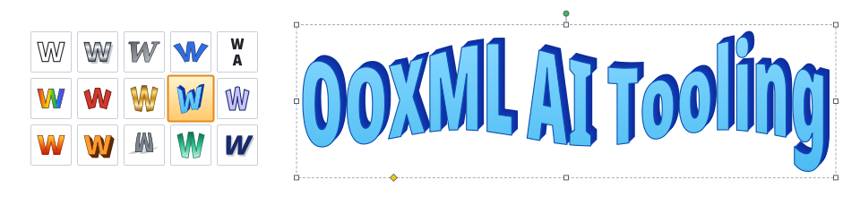
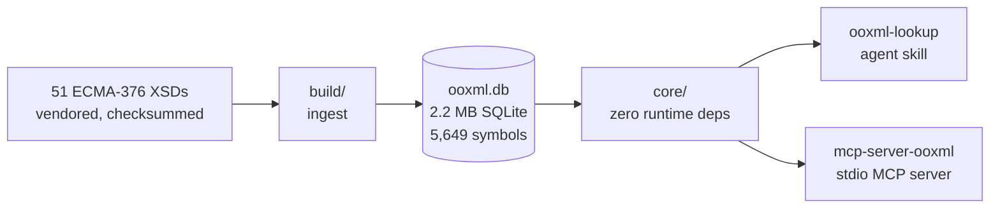

<div align="center">

<picture>
  <source media="(prefers-color-scheme: dark)" srcset="assets/banner-dark.svg">
  
</picture>

Ask the ECMA-376 schema what is legal in a `.docx`, `.xlsx` or `.pptx`, offline.

[](https://www.npmjs.com/package/mcp-server-ooxml)
[](https://github.com/shbernal/ooxml-ai-tooling/actions/workflows/ci.yml)
[](.nvmrc)
[](LICENSE)

---

[Install](#install) • [Quickstart](#quickstart) • [Why?](#why) • [How it works](#how-it-works) • [Not this project](#not-this-project)

---

</div>

<!--
  Demo goes here. Record with VHS (https://github.com/charmbracelet/vhs):
  an agent hits a validator error on w:ind, runs `ooxml explain` on it, then
  `ooxml values s:ST_TwipsMeasure`, and writes w:firstLine="0.5in".
  Export light and dark variants and switch them with <picture>.
-->

An AI agent writing Office markup by hand has to guess what the schema allows, and it usually guesses wrong.
This project gives it the ECMA-376 schema as a local SQLite graph it can query instead.
It ships two ways: an agent skill for agents with a shell, and an MCP server for MCP clients.

- **Children in schema order**, with cardinality and the full sequence/choice tree.
- **Attributes and their value space**: inherited attributes, enumerations, patterns, bounds and unions.
- **Validator errors explained**: paste a diagnostic and get back what would have been legal at that position.
- **Transitional and Strict**: answers for either profile, and a diff of what Transitional adds.
- **Every vocabulary**: wordprocessingml, spreadsheetml, presentationml, drawingml, VML and the package parts (`[Content_Types].xml`, `.rels`, `docProps/core.xml`).
- **Local and deterministic**: no account, no network call, no API key.

## Install

Both surfaces need Node 24 or newer.

### MCP server

Add it to your MCP client's config. The database ships inside the npm package, so there is nothing to download on first run.

```json
{
  "mcpServers": {
    "ooxml": {
      "command": "npx",
      "args": ["-y", "mcp-server-ooxml"]
    }
  }
}
```

### Agent skill

Install `ooxml-lookup` into your agent's skills directory:

```bash
npx skills add shbernal/ooxml-ai-tooling
```

Also published on [ClawHub](https://clawhub.ai/shbernal/skills/ooxml-lookup).

### Which one?

| Your agent | Use |
| --- | --- |
| Has a shell, like Claude Code or Codex | The skill. It also offers read-only SQL over the graph. |
| Speaks MCP, like Claude Desktop | The MCP server. |
| Runs in the cloud with no filesystem and no MCP | Neither. Both need a local process. |

The two return identical answers. Both are thin adapters over one shared core.

## Quickstart

Say you are hand-writing a paragraph in a `.docx` and want to indent it.

1. Ask what attributes `w:ind` takes:

   ```console
   $ ooxml attributes w:CT_Ind
   {"type":"w:CT_Ind","count":12,"attributes":[
     {"name":"firstLine","qualified":true,"use":"optional",
      "type":{"qname":"s:ST_TwipsMeasure","kind":"simpleType"}}, …]}
   ```

2. Ask what values `firstLine` accepts:

   ```console
   $ ooxml values s:ST_TwipsMeasure
   {"type":"s:ST_TwipsMeasure","one_of":[
     {"type":"s:ST_UnsignedDecimalNumber","base":"xsd:unsignedLong"},
     {"type":"s:ST_PositiveUniversalMeasure",
      "facets":{"pattern":"[0-9]+(\\.[0-9]+)?(mm|cm|in|pt|pc|pi)"}}]}
   ```

   So `w:firstLine="720"` and `w:firstLine="0.5in"` are both legal, and the units are a closed set of six.

3. Got a validation error instead? Hand it over as-is:

   ```console
   $ ooxml explain "Sch_UndeclaredAttribute: The 'bogus' attribute is not declared. at /w:document[1]/w:body[1]/w:p[1]/w:pPr[1]/w:ind[1]"
   {"resolved":true,"finding":{"kind":"undeclared_attribute","name":"bogus"},
    "message":"The 'bogus' attribute is not allowed on w:ind. Its legal attributes are listed below.", …}
   ```

The skill runs these as `node scripts/ooxml.mjs <command>`.
The MCP server exposes the same questions as `ooxml_attributes`, `ooxml_values`, `ooxml_explain` and seven more.
See [`skill/SKILL.md`](skill/SKILL.md) for the CLI and [`mcp/README.md`](mcp/README.md) for the tool list.

## Why?

A schema browser that reads the XSDs naively gives confident wrong answers. These are the cases it gets wrong:

| Question | Naive answer | This project |
| --- | --- | --- |
| What goes inside a DrawingML type whose content is a group reference? | Nothing | The expanded group |
| Children of a type that extends a base | Its own children only | Base children first, each tagged with the type that contributed it |
| What is `w:tblPr`? | One content model | Both, each labelled with where it applies |
| Values of bare `ST_Direction` | One of them | All three: `ltr\|rtl` (wml), `horz\|vert` (pml), `norm\|rev` (dml-diagram) |
| Is `x:worksheet` valid input? | No prefix is bound in the schema | Yes, resolved as `sml:worksheet` |

The closest existing project is [`superdoc-dev/ooxml-dev`](https://github.com/superdoc-dev/ooxml-dev), and it is good prior art.
The difference is where it runs:

| | ooxml-dev | ooxml-ai-tooling |
| --- | --- | --- |
| Runs | Hosted service at `api.ooxml.dev/mcp` | On your machine |
| Account | Required | None |
| Network | Every query | Never |
| Spec prose and semantic search | Yes | No |
| Agent skill for shell-only agents | No | Yes |

If your question is "what does the spec say about X", use ooxml.dev.
If it is "what is structurally legal here", use this.

## How it works



- The repo vendors the schemas byte-for-byte, with checksums in [`schemas/PROVENANCE.md`](schemas/PROVENANCE.md).
- The build is deterministic. CI rebuilds the database and compares a canonical dump against the committed copies.
- The graph keys symbols on the vocabulary, not the namespace URI. Transitional and Strict are one vocabulary under two sets of URIs, so "is this in Strict too?" is a join, not a guess.
- The core uses only Node builtins like `node:sqlite`, which is why the skill runs from a bare checkout.

## Not this project

- **Validating a file.** That is [`ooxml-validate`](https://github.com/shbernal/ooxml-validate), which wraps Microsoft's `OpenXmlValidator`. This project never opens your document. `explain` reads a validator's diagnostic and answers from the schema.
- **Reading the specification text.** No prose, no PDFs, no embeddings. [ooxml.dev](https://ooxml.dev) does that.
- **What Word or Excel actually do.** Implementations diverge from the standard, and this project does not model those divergences.

## More

- [`mcp/README.md`](mcp/README.md): MCP tools, prefixes and profiles.
- [`skill/SKILL.md`](skill/SKILL.md): the CLI and how an agent should use it.
- [`CONTRIBUTING.md`](CONTRIBUTING.md): building the database and running the checks.

The vendored ECMA-376 schemas are redistributed unmodified under Ecma International's free-availability terms and Microsoft's Open Specification Promise.
